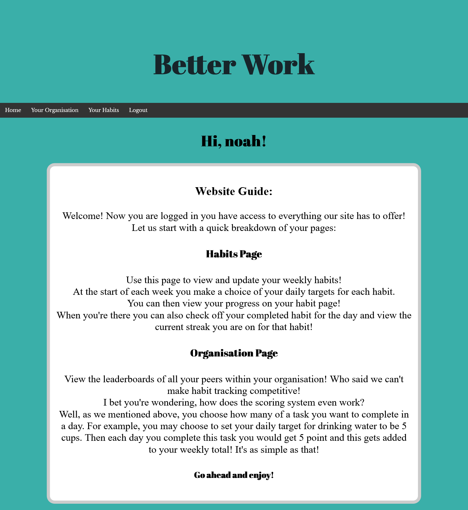

# Better Work

**Welcome to Better Work** 
**Better get to work!** 
**BETTER WORK**

View your organisations leaderboards to see your position and **stick it** to your peers that are below you!  
Funnily enough, if you stick **it** infront of the website title you get our groups slogan for the duration of this project!

Come get involved in Better Work!

## Table of Contents

- [Installation & Usage](#installation--usage)
  - [Installation](#installation)
  - [Local Usage](#usage)
  - [Deployment](#deployment)
- [Technologies](#technologies)
- [Authentication](#authentication)
- [Changelog](#changelog)
- [Wins & Challenges](#wins--challenges)
  - [Wins](#wins)
  - [Challenges](#challenges)
- [Bugs](#bugs)
- [Goals for the Future!](#goals-for-the-future)

## Installation & Usage

### Installation

- Clone or download the repo
- Navigate to the `Noahs-Arg-Client` folder at the command line
- Run `npm install` to install dependencies

### Local Usage

- Run `npm run dev` to compile the source code and start a server on `localhost:8000`

### Deployment

- View the client live on [Netlify](https://better-work.netlify.app/)

#### Testing

- While in the `client` folder run `npm test` to launch the test suite

## Technologies used

#### Planning & Design Tools

- Github Projects - view our Kanban board in this repo
- Figma ([View our template here](https://www.figma.com/file/0ZiuVJqrR8aZgUNDM9nlTG/Untitled?node-id=7%3A194))

#### HTML/CSS/JS Tools

- Concurrently
- Watchify

#### Authentication

- JWT_decode

#### Testing

- Jest
- Jest-fetch-mock

## Authentication & Authorisation

In order to grant access to our page we utilised JWT technology. This allows us to perform stateless verification of our users. Each time user logs in they are presented with a JWT with an expiration time of 1000s. After this time limit they will have to log out and log back in if they want to use their privileges.

## Changelog

- Add login/registration forms
- Add personal page
- Add favicon
- Create template for org.html
- Swipe element on org.html
- Implement auth&auth
- Set up handler for populating leaderboards
- Set up GET request for single user
- Add select habit form
- Creat remaining handler fcts
- On wrong password box highlights red
- Login forms disappear on login
- Leaderboards working
- Set up daily habit form
- Create fct to check when people last visited
- Fix personal page contents on DOM load
- Home page layout
- Add logout button
- Add navbar to top of all pages
- Finish update route for habit selection
- Style habit select form
- Layout for org.html
- Finish layout for personal page

## Wins & Challenges

### Wins

- Working authentication and authorization
- Implemented cool leaderboards feature
- Setting up the server to update the current/highest streaks for each habit of a user
- Visual effect on ticking checkboxes
- Setting up handler to update database on daily habit completion

### Challenges

- Server-side testing
- Deciding on how to get the app to recognise when to send someone a habit selection form
  - Save a `last_visted` attribute tag for each user with a value for the week of the year they last visited on
- Adhering to the routes stated in the Source of Truth

## Bugs

- It doesn't automatically log you out on token expiration
- Streaks don't update on submission of daily completions
- If you fail to complete on a Friday it doesn't reset your streak
- If a user logs in at the same week a year later they wont get a new form
- Usernames are not unique
- Organisations are case-sensitive (won't tell you if you are creating a new org)
- The client doesn't recognise the day so gives us teh ability to tick off any day
- Need to change `returnNewDocument=true` for `returnDocument="after"` in mongodb queries

## Goals for the Future!

- Implement a feature to change forgotten passwords
  - Use `fingerprintjs` to recognise users without password
  - Only use fingerprint in case of forgotten password as only 85% secure
- Restructue the database so there is a different collection for each organisation. To save space we would only do this once an organisation exceeds a certain amount.
